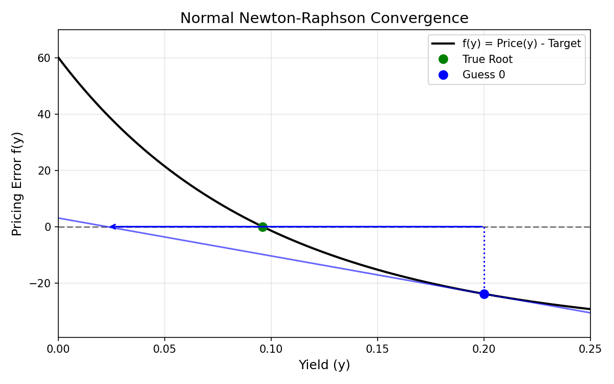
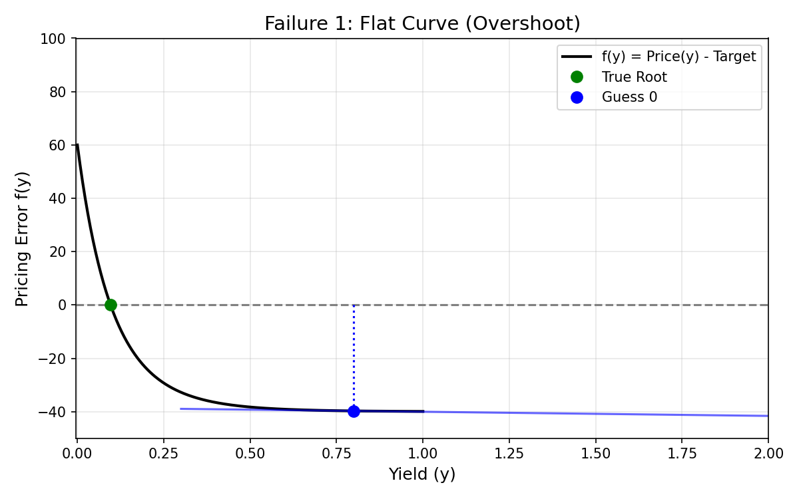
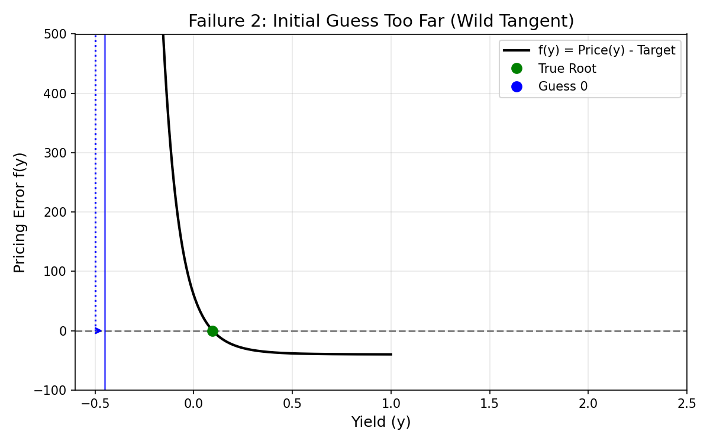
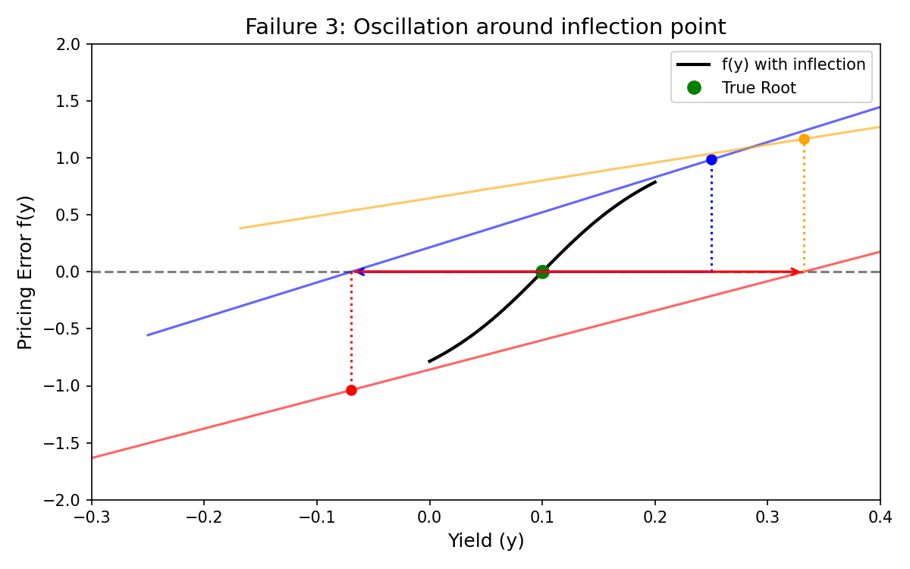

# Newton-Raphson Failure Modes in Yield-to-Maturity Solving

The Newton-Raphson mathematical method achieves extremely rapid (quadratic) convergence when close to a root. However, because it relies on projecting tangent lines from the curve (based on the first derivative), its convergence is not globally guaranteed. 

When pricing bonds—especially distressed instruments or zero-coupon bonds—the price-yield curve possesses distinct convexity that can cause the basic Newton algorithm to break down. Our Fixed Income Analytics Engine solves this by implementing a **Hybrid Newton-Raphson × Bisection** solver. The algorithm attempts the fast Newton step but falls back to Bisection (which offers guaranteed linear convergence) if the Newton guess escapes a known straddling bracket `[a, b]`.

Below are the common failure modes of the pure Newton-Raphson method that our hybrid fallback elegantly prevents.

---

## 0. Normal Convergence (Baseline behavior)

In a well-behaved scenario, the starting guess (Guess 0) is relatively close to the true root. The tangent line (the derivative, representing duration) accurately points down toward the x-axis, intersecting near the true root. Guess 1 is extremely close, and Guess 2 will typically land perfectly on the root.

---

## 1. The Flat Curve (Distressed Bonds)

If an initial guess occurs at an extremely high yield (e.g., >50%), or if the bond is highly distressed and trading at pennies on the dollar, the right-hand tail of the price-yield curve becomes exponentially flat.
*   **The Issue:** At Guess 0, the curve is flat, meaning the tangent line has a very shallow slope.
*   **The Breakdown:** Following that shallow tangent line throws *Guess 1* massively off to the left — sometimes even into massive negative yields. Our hybrid solver catches this by noting `x_next` has escaped the `[a, b]` bracket bounds, discarding the wild guess, and taking a safe bisection step instead.

---

## 2. The "First Step" Problem (Guess Too Far Away)

Newton-Raphson is only guaranteed to converge if the initial guess is "close enough" to the true root. If the algorithm starts with a wild guess (e.g., -50% for a bond that yields 5%), the extreme curvature at that coordinate is unrepresentative of the function near the true root.
*   **The Issue:** The tangent line at Guess 0 is incredibly steep due to massive convexity near 0% or negative yields.
*   **The Breakdown:** The extremely steep slope intersects the x-axis miles away on the right. The next iteration's guess might be an impossibly large positive yield.

---

## 3. Endless Oscillation (The Inflection Trap)

Though more frequent in localized inflection points, high local convexity can cause the algorithm to ping-pong across the target root.
*   **The Issue:** The tangent line from Guess 0 overshoots to the right (Guess 1). The tangent line from Guess 1 is steep enough that it overshoots back to the left (Guess 2).
*   **The Breakdown:** The algorithm becomes trapped in a near-infinite loop, bouncing back and forth over the root but never actually converging on it. The hybrid solver's bracket `[a, b]` is dynamically tightened around the root during every iteration. When the ping-pong step inevitably attempts to jump outside the new, tighter bracket, the bisection fallback crushes the space safely toward the root.
